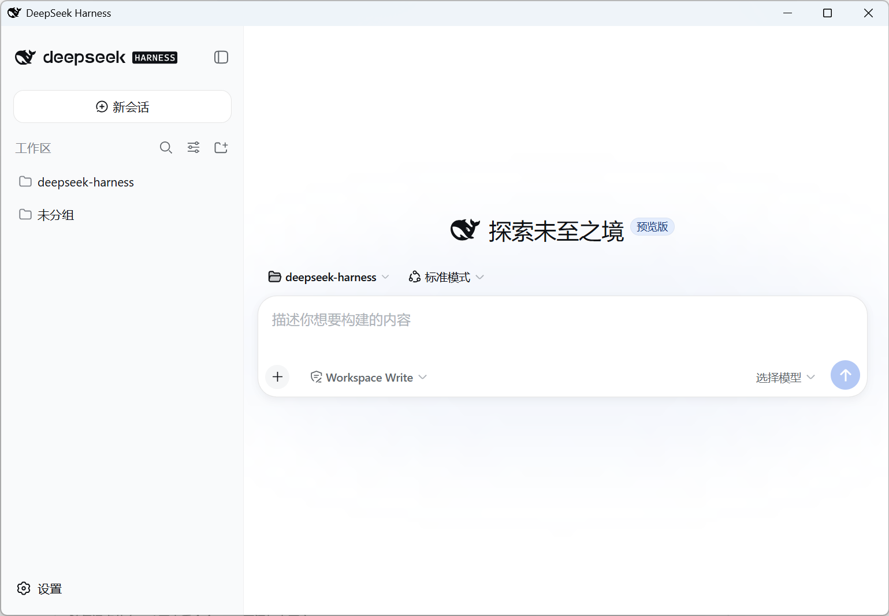

# DeepSeek Harness Desktop

A desktop shell for the [DeepSeek Harness](https://github.com/deepseek-ai) (`@deepseek-ai/dsh`),
built with [Tauri 2](https://v2.tauri.app).

This repository wraps the DeepSeek Harness engine (a Node.js runtime plus the
`@deepseek-ai/dsh` packages) inside a Tauri application, providing a native desktop
experience — system tray, native webview, and an installer — around the harness.

## Architecture

- `src-tauri/` — the Rust/Tauri application shell (product name **DeepSeek Harness**,
  identifier `com.deepseek.harness.desktop`).
- `src-tauri/resources/engine/` — the bundled Node.js engine and harness packages.
  Large binaries here are git-ignored and re-fetched via the helper scripts below.
- `src-tauri/assets/` — loading/splash UI and theme watcher.
- Root scripts (`fetch-pkgs.mjs`, `fetch-missing.mjs`, `extract-tgz.py`) — download and
  unpack the `@deepseek-ai/*` engine packages from the npm registry.

## Prerequisites

- Node.js (>= 18) and [pnpm](https://pnpm.io)
- Rust (stable) and Cargo
- Tauri 2 platform prerequisites: WebView2 (Windows) and the platform build tools
  (Windows SDK / C++ Build Tools)
- Python 3 (used by `extract-tgz.py` to unpack engine tarballs)

## Getting started

```bash
# 1. Install JS dependencies
pnpm install

# 2. Fetch the DeepSeek Harness engine packages into node_modules
node fetch-pkgs.mjs        # pulls @deepseek-ai/dsh and related packages
node fetch-missing.mjs     # fills in any additionally required packages

# 3. Run in development
pnpm tauri dev

# 4. Build a production installer (MSI on Windows)
pnpm tauri build
```

The production installer is produced under `src-tauri/target/release/bundle/`.

## Screenshots



*Main interface: workspace sidebar, model selector, and input prompt.*

## Repository contents

Build artifacts and large binaries are intentionally excluded from version control via
`.gitignore`:

- `node_modules/`, `target/`, `dist/`
- `*.tgz`, `*.zip`
- `portable/`, `DeepSeek-Harness-portable/`
- `src-tauri/resources/engine/node.exe` and other engine binaries

The engine runtime is re-fetched with the scripts above, so a clean clone can be rebuilt
without committing the large binaries. **No secrets, keys, or `.env` files are tracked.**

## Configuration

Tauri configuration lives in `src-tauri/tauri.conf.json`. The harness engine is configured
through its own settings, which are stored on the local machine at runtime.

## License

No license file is included yet. Add a `LICENSE` before distributing.

---

# DeepSeek Harness Desktop（中文）

基于 [Tauri 2](https://v2.tauri.app) 构建的 [DeepSeek Harness](https://github.com/deepseek-ai)（`@deepseek-ai/dsh`）桌面外壳。

本仓库将 DeepSeek Harness 引擎（Node.js 运行时 + `@deepseek-ai/dsh` 相关包）封装进一个
Tauri 应用中，为 Harness 提供原生桌面体验——系统托盘、原生 WebView 以及安装包。

## 架构

- `src-tauri/` — Rust/Tauri 应用外壳（产品名 **DeepSeek Harness**，标识符 `com.deepseek.harness.desktop`）。
- `src-tauri/resources/engine/` — 内置的 Node.js 引擎与 Harness 包。其中的大型二进制文件已被
  git 忽略，并通过下方的辅助脚本重新获取。
- `src-tauri/assets/` — 加载/启动界面与主题监听脚本。
- 根目录脚本（`fetch-pkgs.mjs`、`fetch-missing.mjs`、`extract-tgz.py`）— 从 npm  registry
  下载并解包 `@deepseek-ai/*` 引擎包。

## 环境要求

- Node.js（>= 18）与 [pnpm](https://pnpm.io)
- Rust（stable）与 Cargo
- Tauri 2 平台依赖：WebView2（Windows）以及平台构建工具（Windows SDK / C++ 生成工具）
- Python 3（供 `extract-tgz.py` 解包引擎压缩包）

## 快速开始

```bash
# 1. 安装 JS 依赖
pnpm install

# 2. 拉取 DeepSeek Harness 引擎包到 node_modules
node fetch-pkgs.mjs        # 拉取 @deepseek-ai/dsh 及相关包
node fetch-missing.mjs     # 补齐其他所需包

# 3. 开发模式运行
pnpm tauri dev

# 4. 构建生产安装包（Windows 下为 MSI）
pnpm tauri build
```

构建出的安装包位于 `src-tauri/target/release/bundle/` 目录下。

## 截图


*主界面：工作区侧边栏、模型选择器与输入框。*

## 仓库内容说明

构建产物与大型二进制文件已通过 `.gitignore` 有意排除在版本控制之外：

- `node_modules/`、`target/`、`dist/`
- `*.tgz`、`*.zip`
- `portable/`、`DeepSeek-Harness-portable/`
- `src-tauri/resources/engine/node.exe` 及其他引擎二进制文件

引擎运行环境可通过上述脚本重新获取，因此全新克隆的仓库无需提交大型二进制也能重新构建。
**本仓库不追踪任何密钥、私密信息或 `.env` 文件。**

## 配置

Tauri 配置位于 `src-tauri/tauri.conf.json`。Harness 引擎通过其自身设置进行配置，相关设置保存在
本机运行时目录中。

## 许可证

目前未包含许可证文件。若打算分发，请先添加 `LICENSE`。
